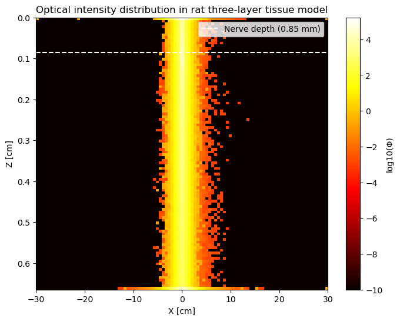

# Photon Transport and Semiconductor Modeling for Neural Stimulation

This repository implements a computational model combining Monte Carlo photon transport in biological tissues with semiconductor physics to study optoelectronic neural stimulation.

## Installation

Install required Python packages:
```bash
pip install numpy matplotlib
```

## Usage

Run the main script to perform:
1. Light propagation simulation in 3-layer tissue
2. Photovoltaic effect calculation
3. Semiconductor device modeling

```bash
python Modeling_Photon_Transport_Semiconductor_for_Neural_Stimulation.ipynb
```

## Theory

### Photon Transport Model
- Monte Carlo simulation of light propagation through skin layers (dermis, fat, muscle)
- Tracks photon absorption and scattering using tissue optical properties:
  ```math
  \mu_t = \mu_a + \mu_s, \quad g = \langle \cos\theta \rangle
  ```

### Optoelectronic Conversion
- Calculates photocurrent density at nerve depth:
  ```math
  J_{photo} = qG(L_1 + L_2), \quad G = \frac{I_{nerve}}{h\nu}(1-e^{-k_{diss}/k_{rec}})
  ```
- Computes open-circuit stress from semiconductor properties

### Semiconductor Model
- Solves drift-diffusion equations for organic semiconductor heterojunction
- Models charge carrier transport with:
  - Band structure alignment (H2Pc/PTCDI)
  - Recombination/generation kinetics
  - Poisson equation for potential distribution

## Results



## Applications
- Optogenetic neural stimulation
- Photovoltaic neural interface design
- Tissue-light interaction studies

## References
Based on principles from:
1. Biomedical optics literature for tissue modeling
2. Semiconductor device physics for organic PV cells
3. Optoelectronics for neural interfaces

## Contributing
Contributions welcome via pull requests. For questions contact: karina_urazova@icloud.com
